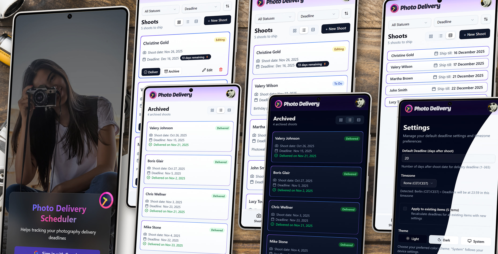

# Photo Delivery Scheduler



A simple mobile-first web app for photographers to keep track of photo delivery deadlines. Made for my wife who was using a note-taking app to track her shoots and deliveries - this is just a more convenient way to do the same thing.

## What it does

- **Track deadlines**: Enter a shoot date and it calculates the delivery deadline (default is 30 days, but you can change it). You can also set a custom deadline if needed.

- **Keep track of clients**: Each entry has a client name, shoot date, deadline, notes, and status (To Do → Editing → Delivered → Archived).

- **Filter and sort**: View by status (all, to do, editing, delivered), sort by deadline, shoot date, or client name. Archived items go to a separate page.

- **Multiple view options**: Choose between full cards (shows everything), compact cards (less spacing), or list view (one line per item).

- **Works on mobile**: Responsive design, works on phones and tablets. You can install it as a PWA (progressive web app) if you want.

- **Google sign-in**: Simple authentication with your Google account. Each user only sees their own data.

## Tech Stack

Built with:

- **Next.js 15** (App Router, TypeScript)
- **Tailwind CSS v4** + **shadcn/ui** components
- **Neon Postgres** database (serverless)
- **Drizzle ORM** for database queries
- **Auth.js** for Google OAuth
- **Luxon** for timezone handling

## How to Deploy Your Own Instance

### What you need

- Node.js 18+
- A [Neon](https://neon.tech) account (free tier works)
- Google OAuth credentials (for sign-in)

### Setup

1. Clone and install:

```bash
git clone https://github.com/andrii-zhygalko/photo_delivery_scheduler.git
cd photo-delivery-scheduler
npm install
```

2. Create `.env.local` file (copy from `.env.example`):

```env
NEON_DATABASE_URL="your-neon-postgres-connection-string"
NEXTAUTH_URL="http://localhost:3000"
NEXTAUTH_SECRET="generate-with-openssl-rand-base64-32"
GOOGLE_CLIENT_ID="your-google-client-id"
GOOGLE_CLIENT_SECRET="your-google-client-secret"
```

3. Run database migrations:

```bash
npm run db:migrate
```

4. Start the dev server:

```bash
npm run dev
```

Open `http://localhost:3000`

### Database Setup Note

The migrations need elevated database permissions. If you're setting up a fresh database:

- Use your database owner credentials in `NEON_DATABASE_URL` to run migrations
- Optionally, create a restricted user afterward for the running app (though for a simple personal app, using the owner credentials is fine)

## Useful Commands

```bash
npm run dev          # Start dev server
npm run build        # Build for production
npm run db:studio    # Open database GUI (Drizzle Studio)
```

## Deploying to Production

Easiest way is [Vercel](https://vercel.com):

1. Push your code to GitHub
2. Import the repo in Vercel
3. Add the same environment variables from `.env.local`
4. Update `NEXTAUTH_URL` to your production domain
5. Deploy

Don't forget to update your Google OAuth redirect URIs to include your production domain (`https://your-domain.com/api/auth/callback/google`).

The app also works on Netlify, Railway, or any platform that supports Next.js.

## License

MIT License - feel free to use this for your own photography workflow or modify it however you want.
